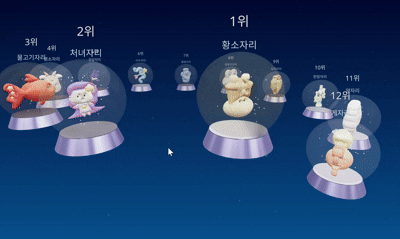

# Zodia - 3D 별자리 운세 뷰어
[✨오늘의 운세 보러가기](https://zodia-zeta.vercel.app)
## 프로젝트 소개


**Zodia**는 Three.js를 활용한 인터랙티브 3D 별자리 운세 웹 애플리케이션입니다.
일본의 TV Asahi 운세 사이트에서 실시간으로 오늘의 운세를 크롤링하고, 자동 번역하여 12개 별자리를 3D 공간에 시각화합니다.

## 기술 스택

### Frontend
- **React 19**: UI 프레임워크
- **Three.js**: WebGL 기반 3D 그래픽스 엔진
- **@react-three/fiber**: React에서 Three.js를 선언적으로 사용
- **@react-three/drei**: Three.js Helper 라이브러리
- **Zustand**: 경량 상태 관리
- **TypeScript**: 타입 안정성
- **Vite**: 빌드 도구

### Backend
- **Flask**: Python 웹 프레임워크
- **BeautifulSoup**: HTML 파싱 및 크롤링
- **Requests**: HTTP 요청 처리
- **googletrans**: 일본어 → 한국어 자동 번역
- **Flask-CORS**: CORS 설정

## 주요 기능

### 1. 3D 별자리 시각화
- 12개 별자리를 3D 공간에 원형으로 배치
- 순위에 따라 Y축 높이를 다르게 설정하여 시각적으로 표현
- 각 별자리는 투명한 구체, 3D 모델, 파티클 효과로 구성
- OrbitControls로 자유로운 카메라 조작 가능

### 2. 사용자 맞춤 기능
- 생년월일 입력으로 자신의 별자리 등록
- 내 별자리는 크기가 1.3배 확대되고 색상이 다르게 표시
- 카메라가 자동으로 내 별자리에 포커스
- 별자리 클릭 시 상세 운세 모달 표시

### 3. 실시간 운세 크롤링
- TV Asahi 운세 사이트에서 매일 오늘의 운세 크롤링
- 순위, 운세 내용, 행운의 색, 행운의 아이템 수집
- 일본어 → 한국어 자동 번역
- 인메모리 캐싱으로 하루에 한 번만 크롤링하여 응답 속도 개선

## 프로젝트 구조

```
zodia/
├── BE/
│   ├── app.py              # Flask 서버 및 크롤링 로직
│   └── .venv/              # Python 가상 환경
│
└── FE/
    ├── src/
    │   ├── components/
    │   │   ├── three/      # Three.js 3D 컴포넌트
    │   │   │   ├── Background.tsx
    │   │   │   ├── Model3D.tsx
    │   │   │   ├── Scene.tsx
    │   │   │   └── ZodiacSphere.tsx
    │   │   └── ui/         # UI 컴포넌트
    │   │       ├── FortuneModal.tsx
    │   │       └── UserSettings.tsx
    │   ├── hooks/          # Custom React Hooks
    │   │   ├── useFortunes.ts
    │   │   └── useZodiac.ts
    │   ├── stores/         # Zustand 상태 관리
    │   │   └── fortuneStore.ts
    │   ├── types/          # TypeScript 타입 정의
    │   └── utils/          # 유틸리티 함수
    └── package.json
```
